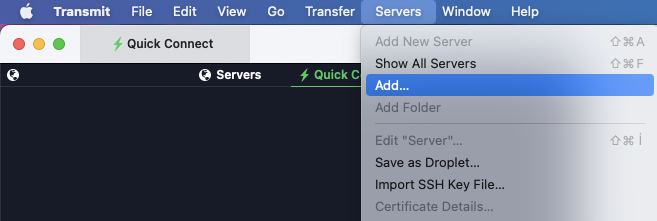
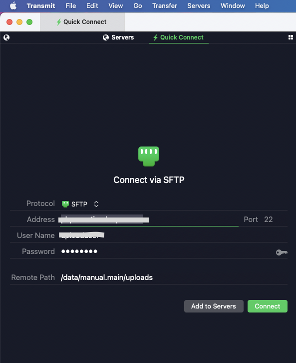
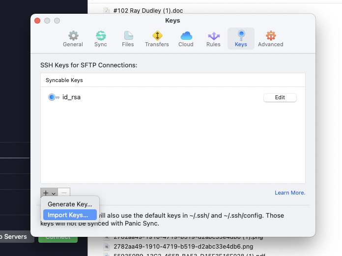
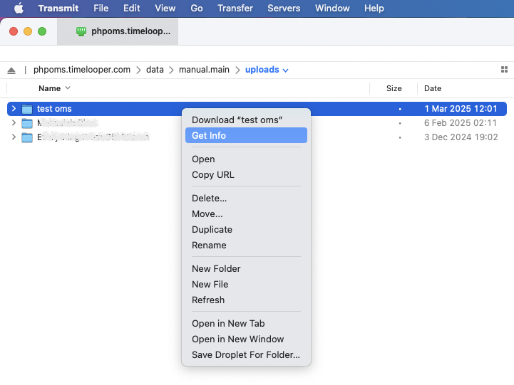
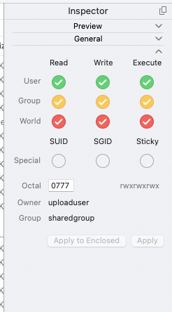

# Manual File Upload Guide on Mac using Transmit

## Introduction
This guide will walk you through the process of uploading files to the remove media server over SCP over SSH using the Transmit application.

## Prerequisites
- Transmit application installed on your computer.
- `Host name`, `Password` and the `User name`, provided by your system administrator.

## Using SCP with Password
1. Open Transmit.
2. Click on the `Servers > Add` button.
   
   

4. Choose `SFTP` from the list of connection types.
5. Enter your server details:
    - **Server:** enter `Host name`
    - **Username:** enter `User name`
    - **Remote Path:** enter `Remote Path`
    - **Password:** click key button and import ssh key (id_rsa) file.
      
      
   
      
      
7. Click `Connect`.
8. Navigate to the desired directory on the server in the left pane.
10. To transfer files from your local computer to the remote machine, just select the files or folders at the left side and drag and drop them to the right side. You can also right click the selection at the left side and choose the context menu item Upload. After a successful transfer, newly uploaded files will appear at the right side.
11. Then select the folder and right click to `Get Info` and check all available permission checkboxes as described in the screenshot.
    

    

13. After having successfully uploaded files into remote `uploads` directory, login to your Online Media Server account. You can now import these files into the Online Media Server using the `Manual Sync` button. 

    
