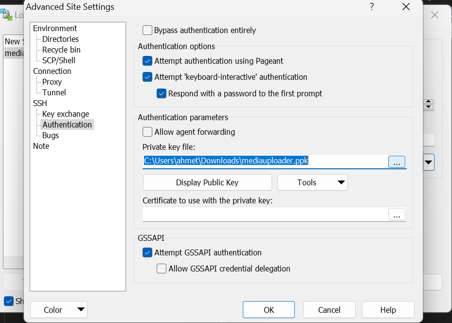

# File Upload Guide using Transmit

## Introduction
This guide will walk you through the process of uploading files to an S3 bucket and using SFTP with SSH keys using the Transmit application.

## Prerequisites
- Transmit application installed on your computer.
- Access to an S3 bucket.
- SSH key pair generated.

## Using SFTP with SSH Keys
1. Open Transmit.
2. Click on the `+ New Connection` button.
3. Choose `SFTP` from the list of connection types.
4. Enter your server details:
    - **Server:** your.server.com
    - **Username:** Your SSH username
5. Click on `Use Public Key Authentication`.
6. Click on the `Key` icon next to the password field and select your private key file.
7. Click `Connect`.
8. Navigate to the desired directory on the server in the left pane.
9. Drag and drop files from your local system to the server.

## Troubleshooting
If you encounter issues connecting to your S3 bucket or SFTP server, please check the following:
- Ensure your credentials are correct.
- Verify your SSH key permissions and that the key is correctly configured on the server.
- Check your network connection and firewall settings.

## Conclusion
You have successfully learned how to upload files to an S3 bucket and use SFTP with SSH keys using Transmit. If you have any questions or need further assistance, please contact your system administrator.

