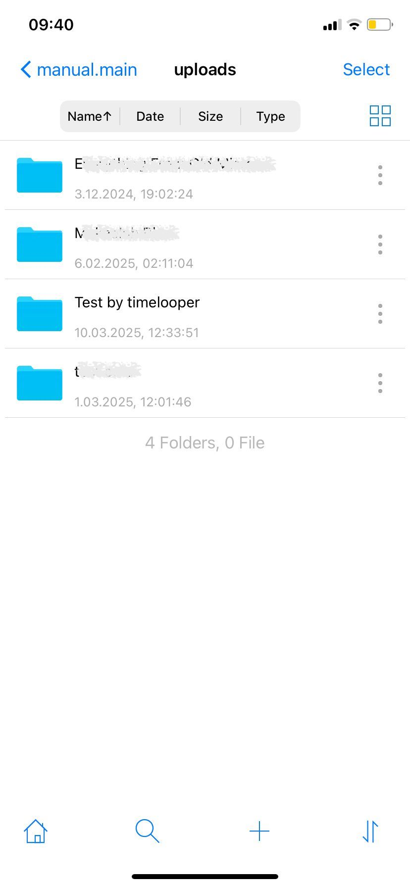

# File Upload Guide using FTP Manager

## Introduction
This guide will walk you through the process of manual uploading of files to the Online Media server. The transfer method   described here is secure and uses the the SCP over SSH protocol. For Iphone users we recommended [FTP Manager](https://apps.apple.com/us/app/ftpmanager-ftp-sftp-client/id525959186).

## Prerequisites
- The FTP Manager application installed on your phone.
- `Host name`, `Password` and the `User name`, provided by your system administrator.

## Configuring FTP Manager
1. When WinSCP launches, it comes with the home page that has a plus button at the right corder, click it and `Login configuration` window open.

2. Choose SFT for this connection.

3. Here you will fill in the `Host name`,  the `User name` and  `Password` fields. Field with the value path is `/data/manual.main/uploads`. Click `Save` to save and close this window and return to the `Home Screen` window.

4. In the `Connections` window, choose the `PHPOMS`. It will navigate to the desired directory on the server in the window.

5. To transfer files from your phone to the remote machine, just select the files or folders at the main window > My files.

6. After select file click copy button at the bottom left corner. And select `PHPOMS`.

7. Transfer will be started after destination folder is selected.

8. Note that this apps do not have any permission control panel. So, we need to update uploaded files' permissions in Transmit/WinSCP using our computers.

9. After having successfully uploaded files into remote `uploads` directory and update their permissions, login to your Online Media Server account. You can now import these files into the Online Media Server using the `Manual Sync` button. 

