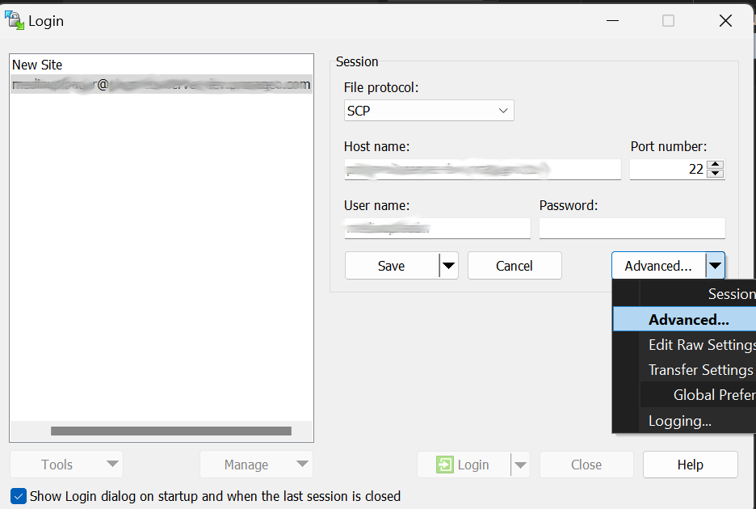
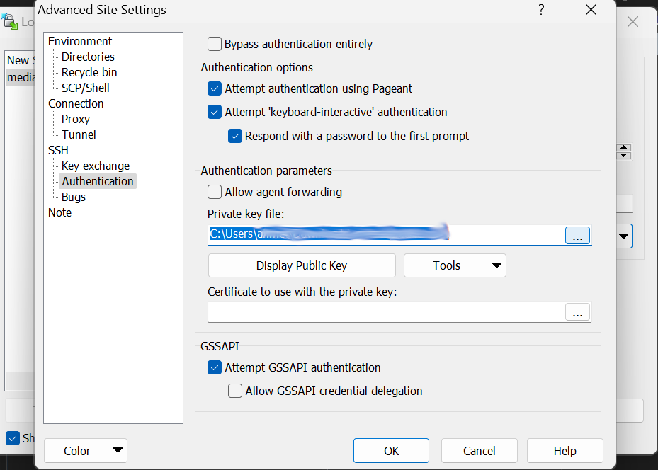
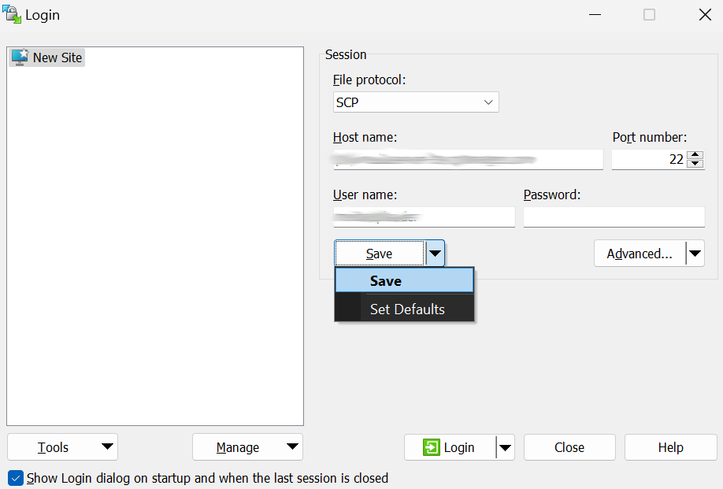
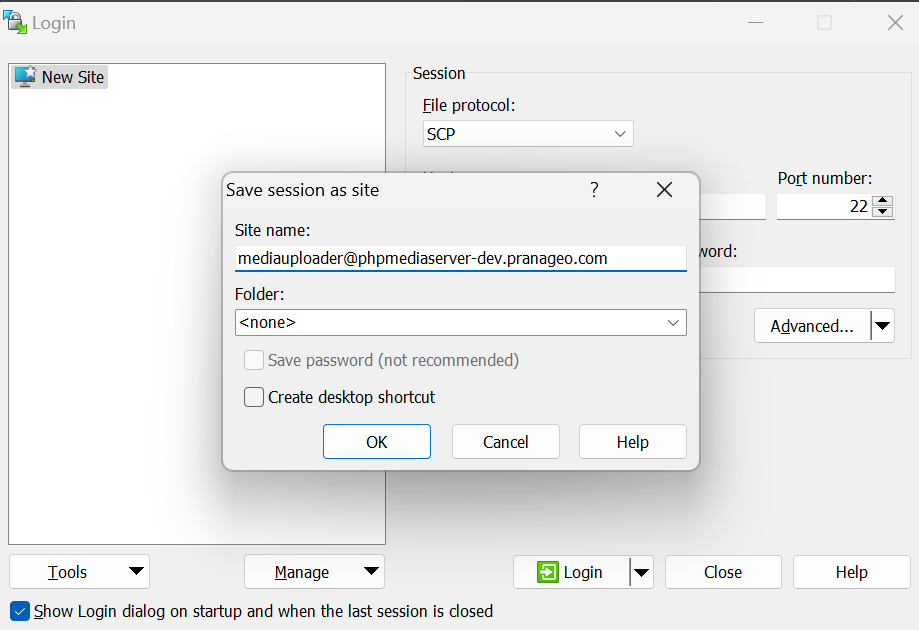
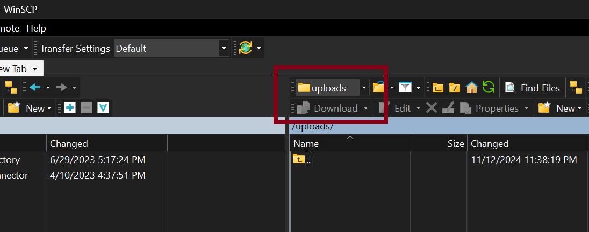

# File Upload Guide using WinSCP

## Introduction
This guide will walk you through the process of manual uploading of files to the Online Media server. The transfer method   described here is secure and uses the the SFTP protocol. For Windows users we recommended [WinSCP](https://winscp.net/).

## Prerequisites
- The WinSCP application installed on your computer.
- `Host name` and the `User name`, provided by your system administrator.
- `SSH key` file (.ppk format), provided by your system administrator.
- `SSH key pass phrase`, provided by your system administrator.

## Configuring WinSCP
When WinSCP launches, it comes with the `Login configuration` window open. Here you will choose the option `SFTP` and then enter the host name and the user name in their respective areas. Do not enter password. Before saving, click on "Advanced"
 

Navigate to the `Authentication` tab of the `Advanced Site Settings` window to set the private .ppk key file. 
Press `OK` to close the "Advanced Site Settings" window 

Choose the `Save` option to save the session.

Enter a descriptive name for your session in the `site name` field. Press `OK` to close the `save session as site` window.

Click `Login` and when prompted, enter the SSH key passphrase.

## Using WinSCP to transfer files
WinSCP is a powerful application that allows bulk tranfer of files between two computers. It also offers features like `Compare Directories` nad `Synchronise` which are useful when transfering a big number of files. If transfer is interrupted for some reason, running the `Synchronise` option will allow you to continue where you left off. This is an improvement over the regular transfers performed over the browser where one needs to start over after a failure.

The WinSCP user interface is divided in two. The file browser at the left side shows the contents of your local machine. The right side shows the remote machine. 

When logged in, you will only see one directory, called `uploads`. Double click in that remote directory name to change into that directory. 

To transfer files from your local computer to the remote machine, just select the files or folders at the left side and drag and drop them to the right side. You can also right click the selection at the left side and choose the context menu item `Upload`. After a successful transfer, newly uploaded files will appear at the right side.

## Importing manually uploaded files into the Online Media Server
After having successfully uploaded files into remote `uploads` directory, login to your Online Media Server account. You can now import these filesinto the Online Media Server using the `Manual Sync` button. 

