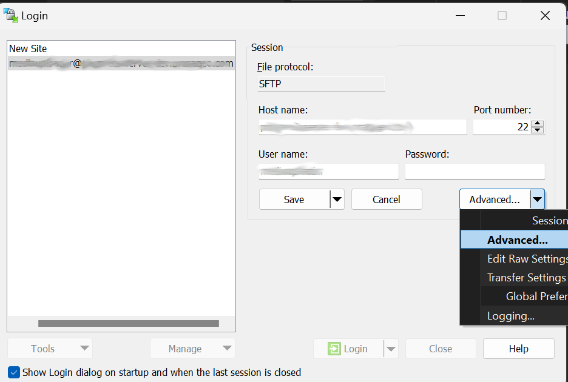

# File Upload Guide using WinSCP

## Introduction
This guide will walk you through the process of securely uploading files the Online Media server using over the SSH protocol. The recommended 
application for the Windows platform is [WinSCP](https://winscp.net/).

## Prerequisites
- The WinSCP application installed on your computer.
- `Host name` and the `User name`, provided by your system administrator.
- `SSH key` file (.ppk format), provided by your system administrator.
- `SSH key pass phrase`, provided by your system administrator.

## Configuring WinSCP
When WinSCP launches, it comes with the `Login configuration` window open. Here you will enter the host name and the user name.
Do not enter password. Before saving, click on "Advanced"
 

Navigate to the `Authentication` tab of the `Advanced Site Settings` window to set the private .ppk key file. 
Press `OK` to close the "Advanced Site Settings" window 

Choose the `Save` option to save the session.

Enter a descriptive name for your session in the `site name` field. Press `OK` to close the `save session as site` window.

Click `Login` and when prompted, enter the SSH key passphrase.

## Using WinSCP to transfer files
WinSCP is a powerful application that allows bulk tranfer of files between two computers. It also offer the `Synchronise` feature
which is useful when transfering a big number of files. If transfer is interrupted for some reason, running `Synchronise` will allow
you to continue where you left off. 

The user interface is divided in two. The file browser at the left side shows the contents of your local machine. The right side shows
the remote machine. Just select the files or folders at the left side and drag and drop them at the right side. Right clicking the selection
and choosing the menu item `Upload` will also work. After a successful transfer operation, uploaded files will also appear at the right side.

